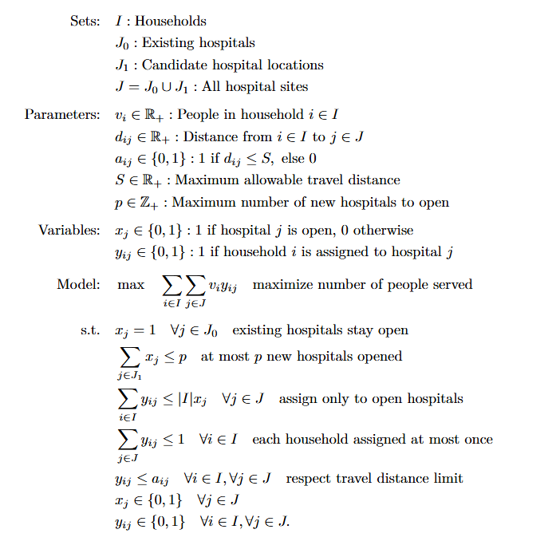
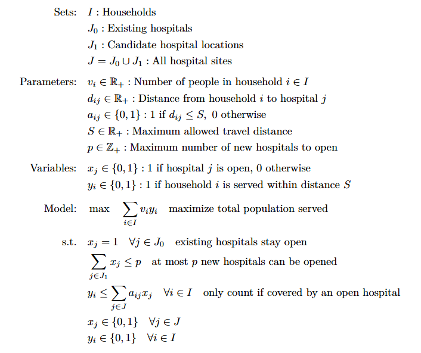
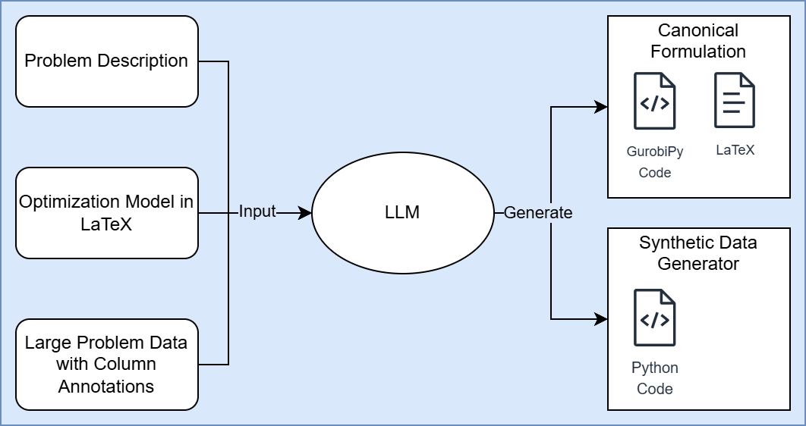
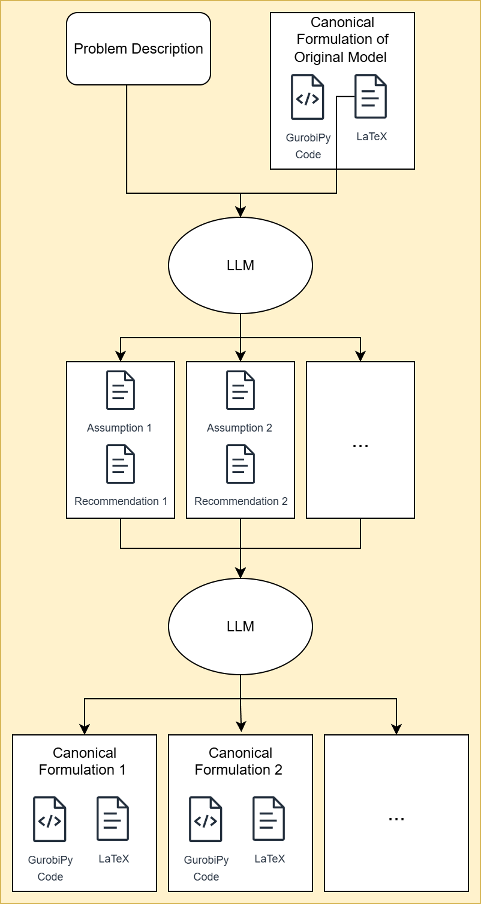

# LLM-Based Efficiency Enhancement of Optimization Models

**What can this tool do?**

This tool leverages Large Language Models (LLMs) to identify inefficiencies in optimization models and generate computationally more efficient alternatives. By analyzing the modeling assumptions in the inefficient formulation and evaluating their necessity within the problem context, the tool creates new, equivalent formulations. For example:

### Example Problem

The objective is to select up to `p` new hospital locations from a list of potential sites to serve as many people as possible in nearby neighborhoods. A neighborhood is considered served if it is assigned to a hospital within `S` units of distance from their home. Additionally, there are `M` existing hospitals that must remain operational.

An inefficient formulation for this problem is shown below:



In this formulation, an implicit assumption is that it matters which specific hospital a household is assigned to. For instance, the model assumes it is important to distinguish whether a household is assigned to hospital 1 or hospital 2.

A more efficient formulation can be derived by relaxing this assumption. The improved formulation is shown below:



---

## Methodology

### Stage 1: Standardization and Data Generation



In the first stage, the tool processes a problem description in natural language, an optimization model in LaTeX, and the associated data. The LLM standardizes the optimization model by creating a canonical version of the formulation. Additionally, it generates a synthetic data generator—a Python script that samples smaller-scale data to mimic the original problem's dataset. These smaller datasets are used in the second stage to validate model equivalence.

### Stage 2: Generating and Evaluating Alternative Formulations



In the second stage, the tool generates multiple candidate formulations and evaluates their performance and equivalence to the original model. The LLM extracts the modeling assumptions from the original formulation and determines whether each assumption is necessary based on the problem context. These assumptions form the basis for creating new canonical formulations. Finally, the tool applies rigorous checks to ensure the new formulations are both faster and equivalent to the original model.


---

## How to Get Started

1. **Clone the repository** (download the code)
2. **Install the required software**:
   ```bash
   pip install -r requirements.txt
   ```
3. **Get an OpenAI API key** (for the model-building features):
   - Sign up at [OpenAI](https://platform.openai.com/)
   - Create a `.env` file in the project folder and add your key:
     ```
     OPENAI_API_KEY=your_api_key_here
     ```
4. **Get a Gurobi license** (free for academics, see [Gurobi website](https://www.gurobi.com/))

---

## How to Use the Project

1. **Describe your problem**
   - In the `src/datasets/your_problem/` folder, add:
     - `detailed description.txt`: Write what you want to solve (in plain English)
     - `inefficient model.tex`: (Optional) If you have a math version, put it here (LaTeX format)
     - `dataset_description.txt`: Describe what kind of data is needed (e.g., list of locations, costs)
     - `large_data.json`: (Optional) Example data for your problem

2. **Run the main program**:
   ```bash
   python -m src.pipeline.main
   ```
   (Or, for older scripts: `python src/main.py`)

3. **What happens next?**
   - The program will:
     1. Read your problem and data
     2. Build a model and create test data
     3. Solve the model with Gurobi
     4. Analyze and suggest improvements
     5. Try out improved models and compare results
     6. Save everything in the `trials/` folder

---

## Project Structure (What's in Each Folder?)

- `models/`: Defines the building blocks for problems and solutions
- `llm/`: Handles all model-building and analysis tasks
- `utils/`: Helper functions for checking data, solving, and comparing models
- `pipeline/`: The main workflow (start here!)
- `datasets/`: Where you put your problem descriptions and data

---

## Requirements

- Python 3.8 or newer
- OpenAI API key (for model-building features)
- Gurobi (with a valid license)
- See `requirements.txt` for details
